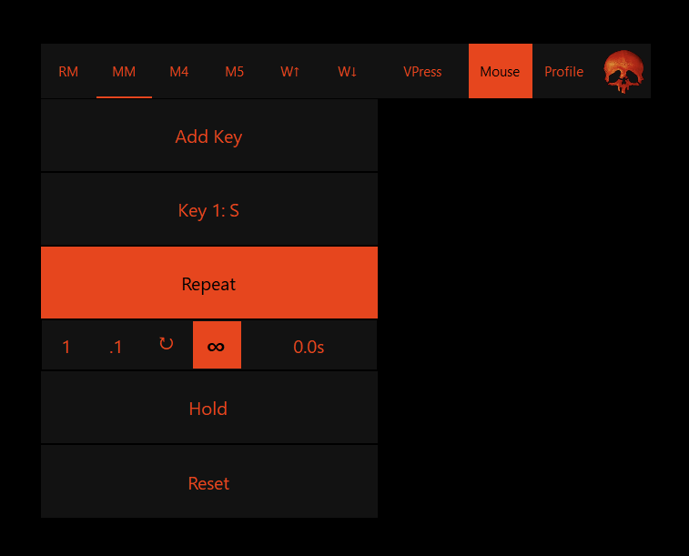
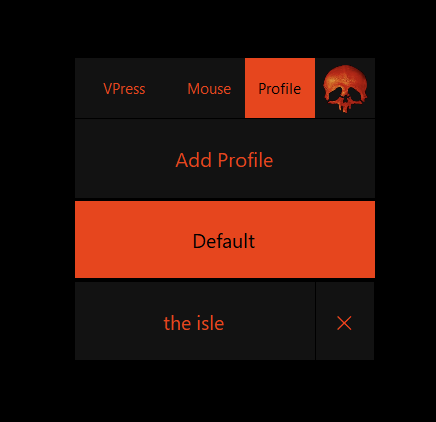
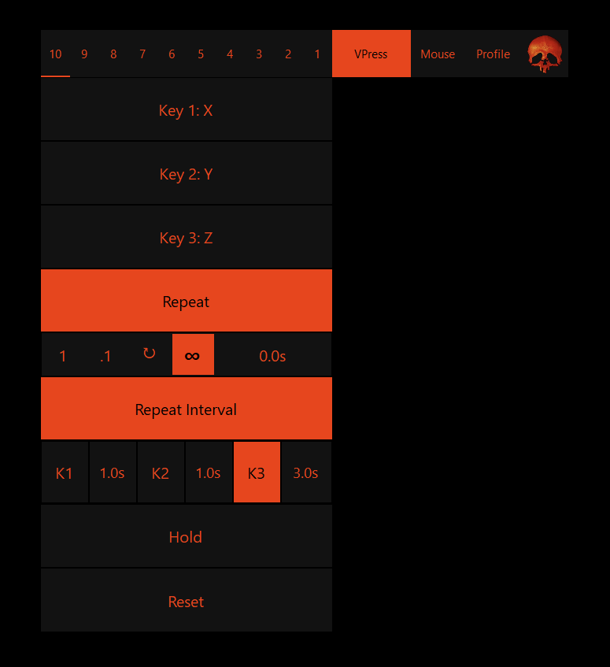

# VoicePress

Remap mouse buttons and voice commands to keyboard keys, with full control over how each one gets pressed — a small Windows overlay built for playing **The Isle: Evrima**.

## Why this exists

VoicePress was built as an accessibility tool, for Fizzil — who is disabled — to be able to play *The Isle: Evrima*, using a normal mouse or a specialized **quad mouse** (a mouse with extra physical buttons). It is **not** intended as a way to play the game hands-free with voice alone.

It's a mouse-button and voice remapper in one: six of a mouse's buttons (Right Click, Middle Click, Mouse 4/5, Wheel Up/Down — Left Click is deliberately left alone, so you always keep the ability to click) and up to ten spoken words each send a keyboard key, with full control over *how* — a single tap, held down, or repeated, for a fixed duration or until you say/press it again. Between the two, it covers game actions for moments a hand isn't free to reach a key.

## Screenshots

  
  

  

## What it does

- Say "press one" through "press ten" to send the matching key.
- Remap Right Click, Middle Click, Mouse 4/5, and Wheel Up/Down to send a key too — Left Click is left alone on purpose, so you can never lose the ability to click.
- Remap which key each word or button sends, set it to tap, hold, or repeat, and manage multiple named profiles — right-click the skull icon for a small dashboard.
- Add up to two more keys to a word or button for a combo, like Ctrl+C — tap and hold press them all together, and repeat cycles through them in sequence, with the timing between each adjustable.
- Say "press stop" to release anything currently held down or repeating — a safety net for whenever a command can't be repeated in time.
- Left-click (or drag) the skull icon to pause listening or move it around the screen.
- Runs fully offline — speech recognition ([Vosk](https://alphacephei.com/vosk/)) happens entirely on your machine. Nothing is sent anywhere.

See [MANUAL.md](MANUAL.md) for the full details — exact voice commands, safety nets, profile behavior, and everything the dashboard does.

## Installing

Grab the latest release from the [Releases page](https://github.com/Fizzil/VoicePress/releases), unzip it, and run the `.exe`. It's self-contained — no separate .NET install needed.

Windows SmartScreen will likely warn that it's from an unrecognized publisher (it's unsigned) — click **More info → Run anyway**.

Requires Windows 10/11 (64-bit) and a microphone.

## A small personal project

This is a small app built for one person's own accessibility setup — not a commercial product. It's shared here in case it helps someone else in a similar situation. See [LICENSE](LICENSE): noncommercial use only, please don't sell it.
