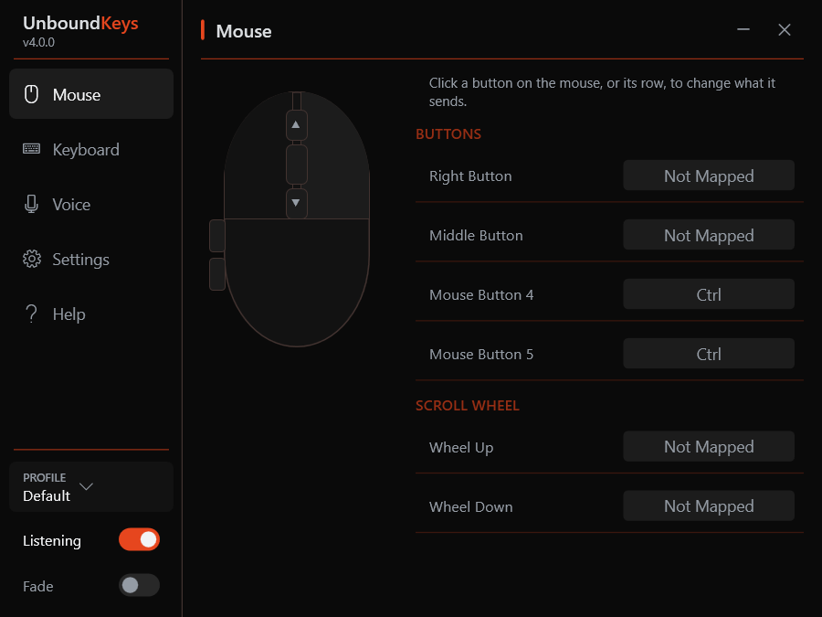
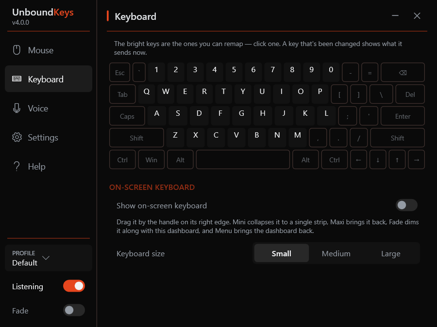
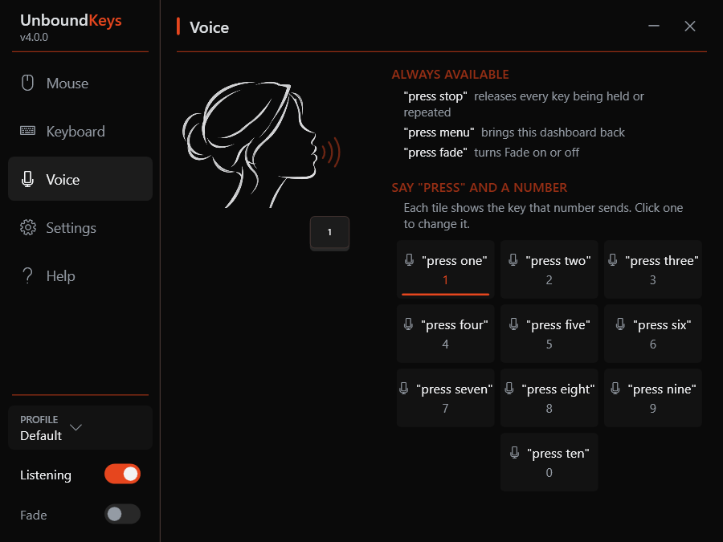
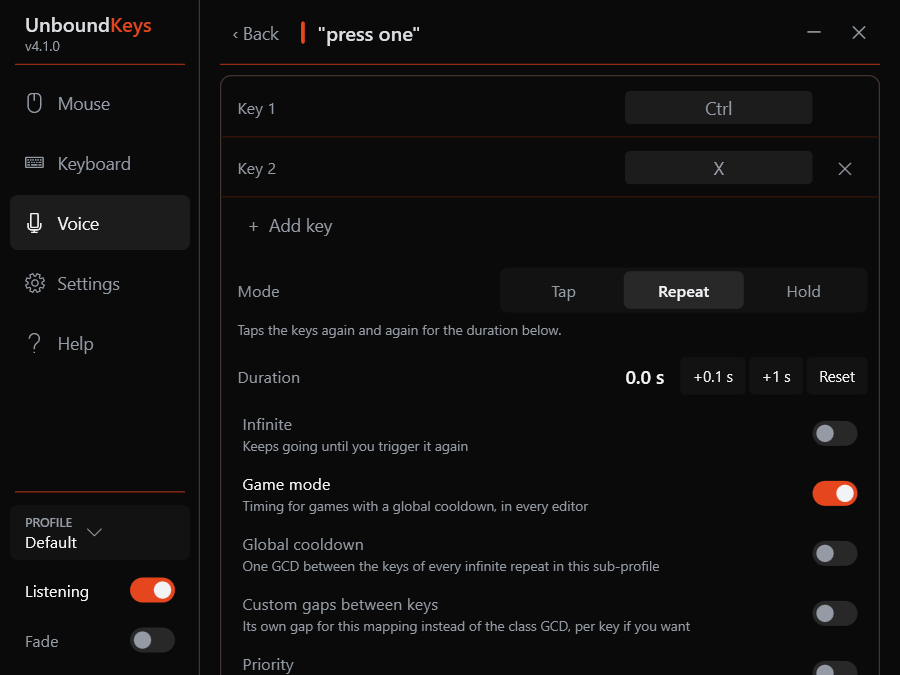
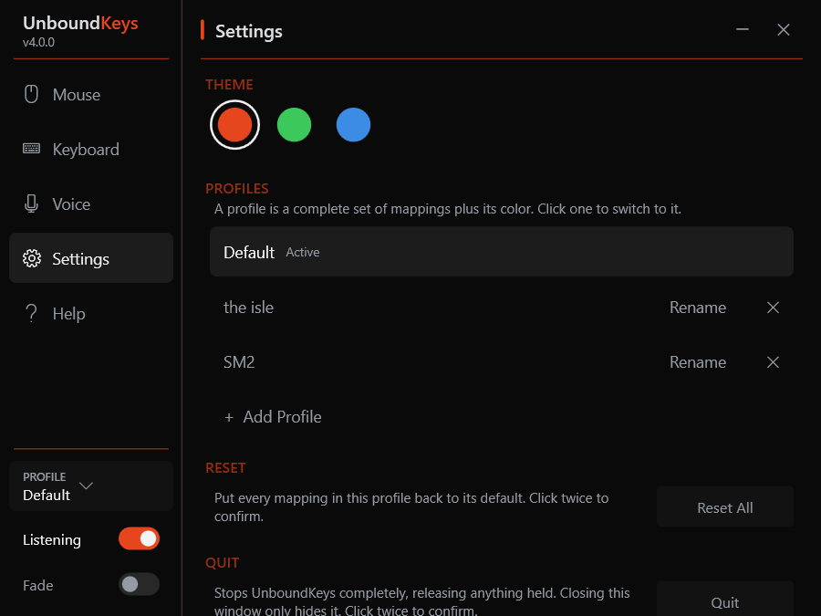
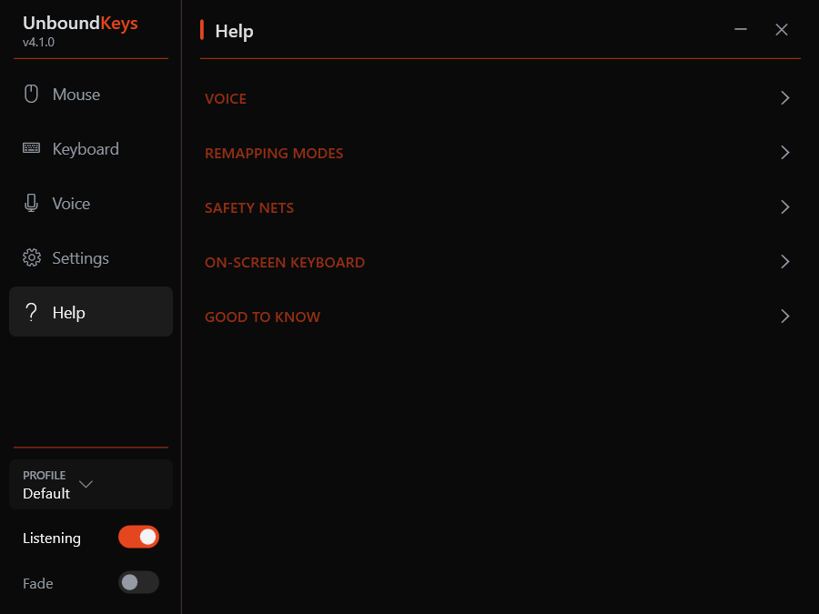
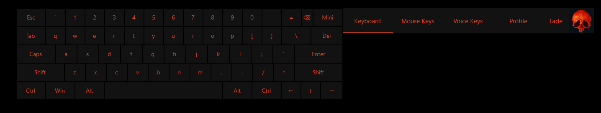
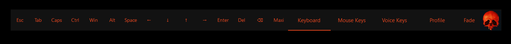

# UnboundKeys

Remap mouse buttons, spoken words and an on-screen keyboard to keyboard keys, with full control over how each one gets pressed — a small Windows app built so one person could play PC games with nothing but a mouse and a microphone.

## Screenshots

  
  
  

  
  
  

## What it does

- **Voice keys** — say "press one" through "press ten" to send a key. Each word can send any key, or a combo of up to six, tapped once, held down, or repeated — for a set time, or until you say it again.
- **Mouse keys** — remap Right Click, Middle Click, Mouse 4/5 and Wheel Up/Down the same way. Left Click is never remapped, so you can always click.
- **On-screen keyboard** — a full keyboard you type on with the mouse: sticky Shift/Ctrl/Alt/Win for combos, hold a key to repeat it, a strip of word suggestions above the keys that learns the words you use, a collapsible Mini strip, and Fade and Menu keys. Its letter and number keys can be remapped too, and remapping one also catches that key on a real keyboard.
- **Profiles** — up to ten complete sets of mappings, each with its own color theme, switched from the dashboard. New ones are named with the mouse; no typing needed anywhere in the app.
- **Built for a mouse** — everything works with left-click alone (no right-click, no scroll wheel, no keyboard), so it keeps working even when those are remapped, and the dashboard never takes focus away from your game.
- **Safety nets** — say "press stop", or click the on-screen keyboard's Caps twice quickly, to release anything held or repeating. "Press menu" brings the dashboard back and "press fade" lifts Fade, both hands-free.
- **Runs fully offline** — speech recognition ([Vosk](https://alphacephei.com/vosk/)) and word suggestions happen entirely on your machine. Nothing is sent anywhere. The one exception is Settings → Check for updates, which asks GitHub for the newest release only when you click it.

See [MANUAL.md](MANUAL.md) for the full details — every command, how each setting behaves, and what the dashboard does.

## Why this exists

UnboundKeys was built as an accessibility tool, for Fizzil — who is disabled — to be able to play PC games such as *The Isle: Evrima* and *Space Marine 2*, using a normal mouse or a specialized **quad mouse** (a mouse with extra physical buttons) plus a microphone. It is **not** intended as a way to play hands-free with voice alone.

It's a mouse-button, voice and on-screen-keyboard remapper in one: six of a mouse's buttons, ten spoken words and the keyboard's letters and digits each send a keyboard key, with full control over *how* — a single tap, held down, or repeated, for a fixed duration or until you say/press it again.

## Installing

Grab the latest release from the [Releases page](https://github.com/Fizzil/UnboundKeys/releases), unzip it, and run the `.exe`. It's self-contained — no separate .NET install needed.

- Windows SmartScreen will likely warn that it's from an unrecognized publisher (it's unsigned) — click **More info → Run anyway**.
- Windows will ask for administrator permission every time it starts. UnboundKeys needs it so its key presses reach games that run elevated; click **Yes**.
- The dashboard opens at launch. Closing it just hides it — UnboundKeys keeps running in the system tray (the skull icon by the clock). Click that icon, press Menu on the on-screen keyboard, or say "press menu", to bring the dashboard back; quit from its Settings page.

Requires Windows 10/11 (64-bit) and a microphone.

## Credits

Speech recognition by [Vosk](https://alphacephei.com/vosk/), microphone capture by [NAudio](https://github.com/naudio/NAudio). The on-screen keyboard's word suggestions use the English list from [FrequencyWords](https://github.com/hermitdave/FrequencyWords) by Hermit Dave (CC BY-SA 4.0), derived from OpenSubtitles.

## A small personal project

This is a small app built for one person's own accessibility setup — not a commercial product. It's shared here in case it helps someone else in a similar situation. See [LICENSE](LICENSE): noncommercial use only, please don't sell it.
